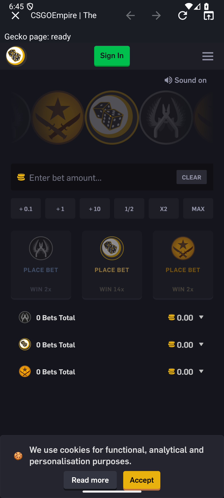

# Issue #12 final cutover verification

Status: **Physical-device/authenticated acceptance pending. Original full run: 37/38; the previously failed website matrix now passes on unchanged APKs (2026-09-08 rerun below).**

The first full independent run rejected the earlier candidate. The APK table below
identifies the corrected candidate. Its full independent run completed with one
network-limited site failure; the three-extension integration and lifecycle checks pass.
The three-extension source is reviewed; no merge or APK publication is authorized by
this receipt alone. Trade Token Sync is deferred with the developer's explicit
approval to [#17](https://github.com/D4gkan/Steam-Account-Manager-App/issues/17).

## Exact source and environment

- Application and instrumentation source: `349a0b73013ef71d9953a8c3598d501845226296`;
  application source unchanged from shutdown repair `3eeebfbb84d9c1ed6ce0312bf6ba519487bdbdb3`.
- Three-package integration checkpoint: `5bbcbf83a9b0c73439d225acc89719e2ee8683b0`.
- Previous source: `c09bd84e9e20656e6299d32b78deedc7604d0f21` (final engine cutover);
  previous PR head: `e34356c63ad9bb7c57f33a324c7cd3ae6064ee04`.
- Branch: `codex/geckoview-campaign`; canonical [PR #14](https://github.com/D4gkan/Steam-Account-Manager-App/pull/14).
- Verification date: 2026-09-08; Windows host, Android Studio bundled JDK 21.0.8, Gradle 8.13,
  compile SDK 36, target SDK 35, minimum SDK 28.
- GeckoView: `153.0.20260810162159`.
- Dedicated emulator: `Codex_GeckoView_Campaign_API_36`, `emulator-5580`,
  Android 16 / API 36 / x86_64. All device commands target this serial. The first
  run used 2 GiB emulator RAM; the corrected run starts after a reboot with 4 GiB
  RAM. The initial corrected run still stalled with automatic headless rendering
  (SwiftShader). The controlled comparison uses explicit `-gpu host`; startup
  confirms the NVIDIA GeForce RTX 3070 Ti Laptop GPU, with the same AVD/API/RAM.
  Emulator version: 36.2.12.0. No production graphics setting was changed.
- No physical device was attached. Earlier #7/#8 Samsung results establish earlier
  checkpoints only; they do not substitute for final three-extension acceptance.

## APKs

Local artifacts are under the ignored `releases/` directory. The Samsung debug APK
is the installable manual-test candidate. Release APKs are **unsigned** because no
release key was configured; they are packaging/R8 evidence, not publishable APKs.

| File | ABI | Bytes | SHA-256 |
| --- | --- | ---: | --- |
| `SAMApp-geckoview-samsung-debug.apk` | arm64-v8a | 267,533,510 | `4A6A93ADFD97D04A1406C59785D805584F9F26F573EDC478699AB78A1AE57BAF` |
| `SAMApp-geckoview-emulator-debug.apk` | x86_64 | 286,956,404 | `8EB0D613A1D579266029C334C2DFED1A887F9579C606CAE3507BD622E03D812A` |
| `SAMApp-geckoview-emulator-androidTest.apk` | test harness | 2,484,021 | `3ECCEE7F53A11416E6097673AEC884AA2C0B0642725FF223C1D4B31270AC7AE4` |
| `SAMApp-geckoview-arm64-release-unsigned.apk` | arm64-v8a | 197,636,865 | `95BE5E71522009839D15ED1C325825B6304F619EF73D30474857E3393A64BF4E` |
| `SAMApp-geckoview-universal-debug.apk` | all bundled ABIs | 599,057,440 | `26F3AB83DEC9DE28B40AED57F3788C37A1BDD2CCF6D86AAAA14A3DF0F86BA10B` |
| `SAMApp-geckoview-universal-release-unsigned.apk` | all bundled ABIs | 529,160,795 | `D652136F94209C7093CB310F0260D101517D311FFDE5B31126CC95EF525B166C` |

Debug APKs verify with APK Signature Scheme v2. The certificate SHA-256 is
`DC99994A7CB9F7CC3D4BF2AEF67C463A4CD091E1ECA6924067B62296958B026D`.
The Samsung and emulator debug APKs contain identical bytes in all 16 DEX files;
the native ABI differs. The tester pulled the installed emulator APKs and confirmed
their hashes match the preserved local files.

The universal debug package is 535,958,245 bytes larger than the recorded
63,099,195-byte pre-Gecko baseline. This includes multiple native ABIs and debug
code; use the ARM64 candidate for the Samsung. An independent active CSFloat
sample on the final host-GPU / 4 GiB emulator totaled 504,533 KiB PSS, with
454,766 KiB in the browser and Gecko children and 49,767 KiB in the default/test
process. The PID set was unchanged before and after sampling. The earlier rejected
2 GiB run sampled 648,210 KiB total (589,616 KiB excluding default/test); it is
historical diagnosis evidence only. These are noisy point observations, not release
memory, battery or performance benchmarks.

## Verified package mapping and provenance

| Website profile | Firefox package | Version | Signed state | Bytes | Official artifact |
| --- | --- | --- | --- | ---: | --- |
| Steam / CSFloat | `{194d0dc6-7ada-41c6-88b8-95d7636fe43c}` | 5.17.0 | 2 | 7,011,169 | [AMO file 4957680](https://addons.mozilla.org/firefox/downloads/file/4957680/csgofloat-5.17.0.xpi) |
| CS.MONEY | `market@csmoney.com` | 5.0.3 | 2 | 1,273,072 | [AMO file 4978360](https://addons.mozilla.org/firefox/downloads/file/4978360/cs_money-5.0.3.xpi) |
| Skins.com | `skinscom-p2p-extension@skins.com` | 1.0.7 | 2 | 127,158 | [AMO file 4898295](https://addons.mozilla.org/firefox/downloads/file/4898295/skins_com-1.0.7.xpi) |

The full package hashes are pinned in [ADR-0001](../adr/0001-adopt-geckoview-for-csfloat.md)
and checked by the shared downloader before Gecko installation. Exact ID, version
and signed state are checked again through Gecko metadata. Every package is used
unmodified. CSGOEmpire and custom HTTPS profiles have no extension controls.

The independent package audit confirmed Mozilla signature material, sizes, IDs,
versions, popup paths and hashes. [CS.MONEY's AMO listing](https://addons.mozilla.org/en-US/firefox/addon/cs-money/)
identifies CS.MONEY and Kiris as authors and links cs.money; its Firefox 5.0.3 package
is distinct from the supplied Chrome 5.0.2 package. We do not claim byte identity
between those versions. [Skins.com's AMO listing](https://addons.mozilla.org/en-US/firefox/addon/skins-com/)
identifies Skins.com; nine shared JS/HTML/CSS assets match its Chrome distribution,
with Firefox-specific background packaging. The AMO API's
`is_mozilla_signed_extension: false` field is not the signature-state test; actual
XPI signatures and Gecko's signed-state metadata are the evidence used here.

## Checks and outcomes

| Check | Result |
| --- | --- |
| Debug application/test compilation | PASS |
| Independent unit tests | PASS — 74/74, 11 suites, no failures/errors/skips |
| Independent debug/release lint | PASS — zero errors; 129/61 warnings and one hint each |
| R8 and unsigned release packaging, x86_64 / ARM64 / universal | PASS |
| Release extension assets | PASS — production Steam detector only; no synthetic marker extension |
| Production WebView / WebKit / restart receiver search | PASS — no remaining implementation or dependency |
| Three official extension install denial, consent, signed state, popup and restart journey | PASS independently at `349a0b7` for all three |
| CS.MONEY real Steam login-helper open/close three times, then A/B lifecycle | PASS independently at `349a0b7`; no credentials entered |
| Android notification privacy, coalescing and pending-show-after-shutdown | PASS independently at `349a0b7`; final test 38 |
| Full independent instrumentation | FAIL — 37 PASS, 1 FAIL (CSGOEmpire timeout), 0 skipped; all 38 completed |
| Final source reviewer | PASS — no blocking source/test findings at `349a0b7` |
| Final Samsung / signed-in marketplace workflows | PENDING |

The final run took 1,034.604 seconds (17m 14.604s). The sole failure was
`supportedPublicWebsitesOpenThroughGecko`: `[csgoempire]` did not finish loading.
All later tests completed successfully, including the independent notification
privacy test. Zero app processes remained after the runner without forced cleanup.
[Per-test results](evidence/issue-12/instrumentation-results.json) retain all 38
outcomes. Original full-run log SHA-256:
`996BBB0294F9BD26CFE23D6D493DF195006446B873582C2D6DBAA519863E5E76`.
Raw logs and synthetic profile archives remain local; only sanitized summaries
and reviewed images are included here.

The build emits existing R8/Kotlin metadata compatibility warnings. Packaging and
lint finish successfully; no build-tool or Kotlin pin was advanced during this work.
The removed machine-specific `org.gradle.java.home` path is replaced by the normal
`JAVA_HOME` configuration. Without release credentials the release variant is
explicitly unsigned rather than failing with a missing signing store.

### Live website matrix

This checks public navigation through the production Gecko shell. A page-stop
callback alone does not establish authenticated marketplace compatibility.

| Site | Observation |
| --- | --- |
| Steam | PASS — final host-renderer sequence reached page-ready; authentication screenshot omitted |
| CSFloat | PASS — public logged-out page rendered; [proof](evidence/issue-12/site-csfloat.png) |
| CS.MONEY | PASS — independent host-renderer sequence and visually reviewed public marketplace; [proof](evidence/issue-12/site-csmoney.png) |
| Skins.com | PASS — independent host-renderer sequence and visually reviewed public marketplace; [proof](evidence/issue-12/site-skins_com.png) |
| CSGOEmpire | FAIL / network-limited — final host-renderer sequence timed out; host HTTPS also timed out after 20 seconds; [timeout surface](evidence/issue-12/site-csgoempire.png) |
| Custom HTTPS (`example.com`) | PASS — Example Domain rendered; [proof](evidence/issue-12/site-custom_https.png) |

The linked images were captured on synthetic profiles without signing in and
visually reviewed before copying into the repository. They show public marketing
content or extension controls, with no account identifiers, QR login payloads,
credentials or personal trade contents. They are original captures; no image was
altered to manufacture a passing result. Debug-only test controls occupy space
above the page; they are absent from release builds. The blank CSGOEmpire image
is explicitly failure evidence, not a loaded-site proof.

### Extension proof

These screenshots show installation disclosure, exact enabled/signed metadata and
unauthenticated official popup rendering. A popup or its initial tracking label
does not prove signed-in marketplace recognition or live tracking.

| Package | Consent | Enabled / signed | Official popup |
| --- | --- | --- | --- |
| CSFloat | [Install access](evidence/issue-12/csfloat-consent.png) | [5.17.0 signed](evidence/issue-12/csfloat-enabled.png) | [Offer Tracking Enabled](evidence/issue-12/csfloat-popup.png) |
| CS.MONEY | [Install access](evidence/issue-12/csmoney-consent.png) | [5.0.3 signed](evidence/issue-12/csmoney-enabled.png) | [Sign in via Steam](evidence/issue-12/csmoney-popup.png) |
| Skins.com | [Install access](evidence/issue-12/skins_com-consent.png) | [1.0.7 signed](evidence/issue-12/skins_com-enabled.png) | [Login / Enable before host grant](evidence/issue-12/skins_com-popup.png) |

[Skins.com explicit Website access](evidence/issue-12/skins_com-host-consent.png)
shows the nine declared optional origins. The final `349a0b7` test separately verifies dismissal
preserves the Enable state, and granting access changes the Steam row to Log in.
[Proof manifest](evidence/issue-12/proof-manifest.json) records original file hashes
for the final full run at `349a0b7`. The earlier focused site frames were replaced
with visually reviewed captures from this final run.

## First independent run and shutdown regression

The full run at `5bbcbf8` ended with 20 PASS, 4 FAIL, 1 interrupted and 12 not started
(out of 37). The three-package integration test passed. The live-site matrix then
failed during process shutdown after Steam/CSFloat; subsequent rendering failures
contaminated the run, which was stopped. This failure was not the CSGOEmpire outage.

ActivityManager recorded current-UID foreground BrowserActivity replacements after
the bounded fallback killed the captured worker. The router still authorized the
old token, so Android could recreate the old profile and prevent stable shutdown.
The corrected controller durably revokes the launch token before worker shutdown
or child cleanup; a fresh rejected activity finishes before its empty worker exits.
The requested next profile is authorized only after confirmed death under the same
routing lock. A failed persistence operation refuses the switch.

The new forced-shutdown regression deliberately stalls A's worker beyond its grace
period, opens B from the default process, checks the old generation has gone, and
returns to A. The primary focused run passed in 16.512s and exercised the bounded
fallback. Its original return marker could recreate missing values, so `3e88ac8`
strengthens the test: the return page uses `A-return` but must read the earlier `A`.
That version failed in 44.403 seconds: the fixture used a session cookie and
abruptly killed fresh, buffered writes. The synthetic profile audit found no
persistent cookie, recreated localStorage, and an IndexedDB value consistent
with the earlier `A`; it did not show B data crossing profiles.

The corrected `349a0b7` fixture uses a persistent synthetic cookie, emits its marker
after the IndexedDB transaction completes, and gracefully stops/reopens A to
verify its original cookie/localStorage/IndexedDB before inducing the stall.
B must remain separate and the final `A-return` must still read the original `A`.
This checks previously persisted state surviving a forced kill; it does not claim
that a crash preserves every unflushed write. [Cookie lifetime semantics](https://developer.mozilla.org/en-US/docs/Web/HTTP/Reference/Headers/Set-Cookie)
explain why a session-only cookie was an unsuitable durable-cookie fixture.
The corrected focused test passed independently in 22.293 seconds, including the
forced fallback, A-persisted baseline and final A-return assertions. The full
38-test independent suite completed: 37 PASS, one network-limited site FAIL.
The forced-shutdown regression passed again in that full run. The contaminated emulator was rebooted
before that run. Old popup proof images were also rejected because accessibility
labels preceded the rendered frame; capture now adds a one-second settling delay and stores
proof inside the debug app's private files directory. Each published image also
requires visual review; the fixed delay alone does not prove that a frame rendered.

## Corrected candidate: rendering investigation

The independent `7b6ed82` build passed 74 unit tests, debug/release lint (zero
errors), and x86_64 release packaging. The focused site sequence failed after
99.562 seconds: the CS.MONEY worker did not initialize Gecko or reach page-ready
within the deadline, then `UiAutomation.takeScreenshot` timed out and returned
null. The full suite was not started. The repaired router rejected the revived
stale activity and the final cleanup completed with zero app processes.

The logs also record incomplete framebuffer errors, subsequent launcher rendering
timeouts and a system-server watchdog warning after app shutdown. This suggests
an emulator graphics problem but does not prove one. EGL warnings alone are not
diagnostic; similar warnings occur at OS boot. The focused host-GPU rerun completed in 115.288 seconds with healthy rendering,
captures and profile cleanup. All sites except CSGOEmpire reached page-ready;
CS.MONEY and Skins.com public screenshots were visually confirmed. CSGOEmpire
alone failed the 60-second page-load deadline. The full suite completed on this
configuration with 37 PASS and the same single CSGOEmpire failure. This comparison supports the renderer diagnosis for this emulator,
without establishing behavior on a physical device.
[Android's emulator graphics documentation](https://developer.android.com/studio/run/emulator-acceleration)
describes selecting a renderer explicitly. Historical failed runs remain rejected.

## Repairs exercised during this run

- A normal tab loading popup HTML lacked Gecko's actual popup context. Official
  popups now use `Action.click` / `ActionDelegate.onTogglePopup`, with an opened
  prepared session; Gecko marks and loads the extension popup itself.
- `TabDelegate.onNewTab` requires an unopened session. Gecko opens it, and the app
  presents a visible helper on its first page-start event. Closing the requesting
  popup is delayed until Gecko has opened the helper. This repairs the API
  ordering; it does not establish the cause of the earlier ANR. Late close
  callbacks recheck session identity, and removed helper load callbacks are ignored.
- The real CS.MONEY button is exercised with touchscreen input. On this API36
  emulator, popup accessibility bounds include the dialog inset twice; the fixture
  removes the extra inset before injecting input. Three actual helper requests
  reached Steam and closed successfully. Earlier failed trials and an ANR were
  diagnosis evidence, not counted as passes.
- Skins.com's background `permissions.request` failed the Gecko user-gesture check
  in the earlier embedding. The app provides explicit Website access using only
  the installed package's declared optional origins. Dismissal leaves access
  unchanged; grant/revoke is verified through Gecko metadata and fails closed.
- The CS.MONEY notification delegate shows only a private generic alert, replaces
  the prior alert, and cancels it on profile shutdown. Synthetic notification
  content is checked not to leak into Android; no live trade notification is claimed.

## Reproduction and final acceptance

With `JAVA_HOME` set to Android Studio's JDK and `ANDROID_HOME` set to SDK 36:

```powershell
.\gradlew.bat testDebugUnitTest assembleDebug assembleDebugAndroidTest lintDebug lintRelease assembleRelease --console=plain
```

For an ABI-specific candidate, pass a temporary Gradle init script using `-I`:

```groovy
allprojects {
    afterEvaluate { p ->
        if (p.plugins.hasPlugin('com.android.application')) {
            p.android.defaultConfig.ndk.abiFilters.clear()
            p.android.defaultConfig.ndk.abiFilters.add('x86_64') // arm64-v8a for Samsung
        }
    }
}
```

The successful rendering run uses the existing AVD with these launch arguments
(the earlier automatic headless renderer selected SwiftShader and stalled):

```powershell
Start-Process -FilePath "$env:ANDROID_HOME\emulator\emulator.exe" -WindowStyle Hidden -ArgumentList '-avd','Codex_GeckoView_Campaign_API_36','-port','5580','-memory','4096','-gpu','host','-no-snapshot-load','-no-snapshot-save','-no-window'
```

Install the x86_64 debug and test APKs on `emulator-5580`, checking both install
results. On this dedicated emulator only, uninstall the two debug packages first
if the limited data partition cannot hold a replacement. Never clear Samsung app
data for the upgrade/persistence check.

```powershell
& "$env:ANDROID_HOME\platform-tools\adb.exe" -s emulator-5580 shell am instrument -w com.steamaccountmanager.app.debug.test/androidx.test.runner.AndroidJUnitRunner
```

Proof is in the debug app's private `files/verification` directory. Preserve the
binary tar stream with Python rather than text redirection in Windows PowerShell:

```python
from pathlib import Path
import os, subprocess
adb = str(Path(os.environ["ANDROID_HOME"]) / "platform-tools" / "adb.exe")
proof = subprocess.check_output([adb, "-s", "emulator-5580", "exec-out", "run-as",
    "com.steamaccountmanager.app.debug", "tar", "-cf", "-", "-C", "files", "verification"])
Path("proof.tar").write_bytes(proof)
```

Extract into a separate local directory, visually inspect each image and publish
only non-identifying proof. Do not upload app profiles, authentication pages or
unfiltered device logs.

The final [Samsung guide](../manual-testing/geckoview-final-release.md) covers the
remaining authenticated injection, extension recognition, refresh/notifications,
A/B storage and identity isolation, rotation, five-minute return, force-stop,
revocation, lock and offline recovery checks. Report unavailable workflows as
UNTESTED. Only the active profile has a worker; simultaneous all-account or
force-stopped tracking is not promised.

## Maintainer handoff update — 2026-09-08

The developer cannot test on the phone now and will handle taking PR #14 out of
Draft. Dagkan will review the embedded emulator gallery, decide on merge, and
perform the remaining physical-device and authenticated checks. This changes
test ownership and sequencing; it does not turn unverified checks into passes.
Keep #12/#3 open until acceptance is recorded. The original CSGOEmpire timeout is retained as historical evidence; the
subsequent emulator rerun below now passes. Final phone acceptance remains pending.

The full universal release build is now also available locally as
`releases/SAMApp-geckoview-universal-release-test-signed.apk` (529,209,078 bytes),
signed with the Android debug certificate for installation and testing only.
SHA-256: `896DD06DEBBBAF5FBDE22B4D33A018855F69C26D4FC215F521560930BE721FBF`.
The certificate SHA-256 is
`DC99994A7CB9F7CC3D4BF2AEF67C463A4CD091E1ECA6924067B62296958B026D`.
`apksigner verify` passes with v3; `zipalign -c -P 16 4` passes. All original ZIP entries
and their uncompressed SHA-256 values match the original unsigned universal
release, whose hash remains in the artifact table above. Only signing metadata was added; no source or original packaged
payload was changed. The APK includes armeabi-v7a, arm64-v8a and x86_64, has
production ID `com.steamaccountmanager.app`, and is not debuggable.

The signed release artifact has not been run through the debug instrumentation
suite. Its install and runtime acceptance are part of Dagkan's remaining checks.
It cannot update an app signed with another key; preserve existing data and use
a separate test device/user profile if necessary. See the updated
[installation and eight-step guide](../manual-testing/geckoview-final-release.md).
No official release has been published or merge performed by this agent.

## CSGOEmpire connection recheck — 2026-09-08, 18:44–18:47 CEST

The earlier timeout no longer reproduces. A direct host request to the unchanged
`https://csgoempire.com/` URL returned HTTP 200 in 0.164 seconds, with its public
HTML and page title. The exact installed application and test APK hashes were
checked against the hashes above before rerunning the existing tests on the same
API 36 AVD with `-gpu host` and 4096 MiB RAM.

- Focused CSGOEmpire site check: **PASS**, 8.65 seconds.
- Complete six-site public matrix: **PASS**, 41.948 seconds. Steam, CSFloat,
  CS.MONEY, Skins.com, CSGOEmpire and the custom HTTPS page all reached page-ready.
- The new original screenshot shows CSGOEmpire rendered and logged out. No
  application code, website URL, timeout, DNS setting or allowlist was changed.

This supports a temporary site or network-path problem during the earlier run.
The saved earlier diagnostics cannot distinguish an upstream outage from routing,
filtering or a connection stall, so a more specific root cause is not claimed.
There was no established application defect to patch; increasing the timeout or
changing domains was not necessary for this passing rerun.

The original full-suite result remains **37/38**. The failed matrix test has now
passed independently; this is not a claim of a fresh 38/38 full-suite run. The
physical-device and authenticated workflows are still awaiting Dagkan's testing.
The full release testing APK is unchanged.



[Machine-readable rerun receipt and proof hash](evidence/issue-12/csgoempire-recheck.json).
The original timeout screenshot and full-run result JSON are preserved.

Reproduce the focused check using the existing APKs:

```powershell
& "$env:ANDROID_HOME\platform-tools\adb.exe" -s emulator-5580 shell am instrument -w -e class 'com.steamaccountmanager.app.ProductionGeckoSessionTest#supportedPublicWebsitesOpenThroughGecko' -e siteWebsite csgoempire com.steamaccountmanager.app.debug.test/androidx.test.runner.AndroidJUnitRunner
```

Omit `-e siteWebsite csgoempire` to run the complete six-site matrix.
